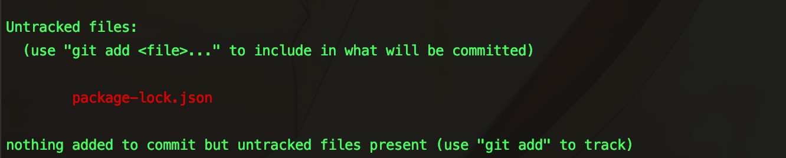
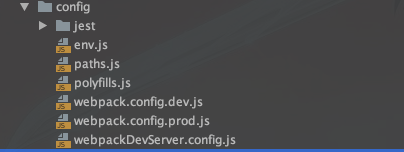

## 目录

- [快捷方式](#快捷方式)
- [写作背景](#写作背景)
- [写作目标](#写作目标)
- [项目安装](#项目安装)
  + [初次尝试](#初次尝试)
  + [初次回顾](#初次回顾)
  + [依赖包拓展](#依赖包拓展)
- [项目调整](#结构调整)
  + [初步思考](#初次回顾)

## 快捷方式

列此表格，旨在更加快捷的找到对应写作章节对应的分支()

| 文章章节 | 分支名 | 描述 |
| :------: | :------: | :------: |
| [初次尝试](https://github.com/CodeMadS2/react-ts-template/tree/feature/first-try) | feature/first-try | 基于项目初始化后进行的简单修改 |


## 写作背景

JavaScript 是一种轻量级的解释性脚本语言，可嵌入到 HTML 页面中，在浏览器端执行，能够实现浏览器端丰富的交互功能，为用户带来流畅多样的用户体验。JavaScript 是基于对象和事件驱动的，无需特定的语言环境，只需在支持的浏览器上就能运行。

TypeScript 是 Microsoft 开发和维护的一种面向对象的编程语言。它是 JavaScript 的超集，包含了 JavaScript 的所有元素，可以载入 JavaScript 代码运行，并扩展了 JavaScript 的语法。

TypeScript 可以使用 JavaScript 中的所有代码和编码概念，TypeScript 是为了使 JavaScript 的开发变得更加容易而创建的。尤其是类型和接口等概念描述正在使用的数据，对于弱类型语言进行了弥补，可谓使得使得编译后的javascript如鱼得水。TypeScript 引入了 JavaScript 中没有的“类”概念。TypeScript 中引入了模块的概念，可以把声明、数据、函数和类封装在模块中。我们可以通过二者结合写出更加健壮的代码，增强了生产力。

## 写作目的

- 解决部分前端同学重复构建基础模块的问题，解放部分生产力

- 结合最新的react全家桶和TypeScript，进行项目模板的构建，让模块化的得到质的提升

- 产出一个基于react脚手架通用项目架构模板，当然你可以结合自己的情况进行简单修改


## 项目安装

首先你要确保自己的电脑安装了node的稳定版本，没有安装的可以 [移步这里](https://nodejs.org/en/)，按照文档自行安装，然后执行以下命令：

```sh
npm install -g create-react-app
```

然后我们创建一个我们自己的项目

 ```sh
 create-react-app react-ts-template --scripts-version=react-scripts-ts
 ```
 
 创建成功后，项目的目录如下
 
 ```
 react-ts-template/
  README.md
  node_modules/
  package.json
  public/
    index.html
    favicon.ico
  src/
    App.css
    App.tsx
    App.test.tsx
    index.css
    demo.ts
    logo.svg
  .gitignore
  images.d.ts  
  package.json
  package-lock.json
  README.md
  tsconfig.json
  tsconfig.prod.json
  tsconfig.test.json
  tslint.json
 ```
 
 如果出现报错等信息，可以先看看自己的网络是否正常，不行开个热点进行初始化，进一步排查问题，欢迎探讨。
 
 注意：
 
 - `tsconfig.json`, `tsconfig.prod.json`, `tsconfig.test.json`, `tslint.json` 包括了ts方面的东西，你可以暂时不用管它，我们扫一眼 `package.json` 里面的 `scripts`选项就可以了。

 - `public` 包含了包含了静态资源如HTML页面或图片。`src` 包含了x项目的源码。`demo.ts` 是入口文件, 当然你也可通过 `package.json` 里面的 `main` 字段进行处理。

### 初次尝试

首先通过命令将项目进行启动：

```sh
npm run start
```
此时浏览器会自动打开 `http://localhost:3000/`, 如果遇到端口占用，进行一下处理

```sh
# 首先查找端口占用的进程
lsof -i tcp:3000
# 杀死进程
kill PID
```
启动成功的话，会看到熟悉的 Logo，来，我们搞点事情，不要别他的目录吓到，记住一点，看一个前端项目，知道入口，知道路由，神马都是浮云。

把入口里面的依赖的 `css` 文件全部删除，项目建构也做了调整，如下：

```
react-ts-template/
  README.md
  node_modules/
  package.json
  public/
    index.html
    favicon.ico
  src/
    component/
      Hello/
        demo.ts
        index.css
    App.jsx
    demo.ts
  .gitignore
  images.d.ts  
  package.json
  package-lock.json
  README.md
  tsconfig.json
  tsconfig.prod.json
  tsconfig.test.json
  tslint.json
```

我这里简单写了个 `Hello` 组件(`src/component/Hello`)

```javascript
import * as React from 'react';
import './index.css';

export interface Props {
    name: string,
    enthusiasmLevel?: number
}

class Index extends React.Component<Props, object> {
    getExclamationMarks(numChars: number) {
        return Array(numChars + 1).join('!');
    }
    render() {
        const { name, enthusiasmLevel = 1 } = this.props;
        
        if (enthusiasmLevel <= 0) {
            throw new Error('you could be a little more enthusiastic. :D');
        }
        
        return (
            <div className="hello">
                <div className="greeting">
                    { name + this.getExclamationMarks(enthusiasmLevel)}
                </div>
            </div>
        );
    }
}

export default Index;
```
此时你可以把我初次尝试的这段代码 `clone` 下来运行

注意：当你修改后执行 `npm run start` 你可能会遇到这样的报错 

```
Compile Error: interface name must start with a capitalized
```

我目前的解决方案是进行 `tslint.json` 修改，具体如下：

```diff
{
-  "extends": ["tslint:recommended", "tslint-react", "tslint-config-prettier"],
+  "extends": [],
+  "defaultSeverity": "warning",
   "linterOptions": {
     "exclude": [
       "config/**/*.js",
       "node_modules/**/*.ts"
     ]
   }
 }

```

官网正在修复此bug，如果此时有更好的方案，欢迎探讨，共进步。

### 初次回顾

此时想了想，发现自己把自己坑了，当我后期想做到更加定制化的打包的时候，一些 `config` 或者是 `package.json` 需要进行修改，那么我在这个脚手架构建出来的项目，没看到什么哪方面的东西啊，于是我查看了下 `package.json` 里面有个特殊的命令 `eject` ，它的意义是如果想要自己修改webpack之类的配置需要执行 `npm run eject` 弹出配置文件，这个操作是不可逆的，于是我直接执行了 `npm run eject` ，然后出来了一些提示，如下图：



于是我把文件先一些文件先 `git stash` 了，然后继续执行 `npm run eject` ，惊喜出现了，项目目录先出现了 `config` 目录，里面包括如下文件：



同时发现了 `package.json` 文件发生了很大的变化，项目所依赖的包都列了出来，`eject` 这个脚本命令也不存在了，重要的事情说三次，避免出现依赖覆盖的情况：

##### 如果项目需要结合 `create-react-app` 脚手架做定制化，就最开始就执行 `npm run eject`。

##### 如果项目需要结合 `create-react-app` 脚手架做定制化，就最开始就执行 `npm run eject`。

##### 如果项目需要结合 `create-react-app` 脚手架做定制化，就最开始就执行 `npm run eject`。

### 依赖包拓展

我想了想，我们的项目中可能会用到 `路由`，`数据状态`，于是我毫不犹豫的选择的生态不错的一下依赖包：

```JSON
	"react-redux": "5.0.5",
    "react-router": "3.0.5",
    "react-router-redux": "^4.0.8"
```

dev中依赖的部分ts相关包

```JSON
	"@types/react-redux": "6.0.9",
    "@types/react-router": "^3.0.5",
    "@types/react-router-redux": "^4.0.48"
```

注意此处有坑，为啥子呢，都知道前端的发展是很猛的，尤其是技术的迭代和开源工具的升级，甚至有时候几个版本，这里我选择了稳一点的 路由V3，结合我们使用的 ts版本(3.0.3) ，我翻阅了文档 查看了 ts相关包，具体见一下地址

[react-redux结合ts对应的type definitions参考版本](https://www.npmjs.com/package/@types/react-redux)

[react-router结合ts对应的type definitions参考版本](https://www.npmjs.com/package/@types/react-router)

[react-router-redux结合ts对应的type definitions参考版本](https://www.npmjs.com/package/@types/react-router-redux)

这里，我对项目骨架做了简单的初步调整，后期会继续优化，先写到这里。

## 项目调整

### 初步思考

为什么会有这一小节的存在了，我结合前端组件化的情况，深入思考了一些，在大型项目中，前端的数据状态很复杂，不同的组件拥有不同的状态，不同的页面有不同的状态，同时不同页面，公用组件也可能有不同的状态，那么问题来了，又是组件，又是状态的，如果大型项目有大大小小大几百的组件，上百的页面我是不是要疯了，当我改一个组件的时候我还需要去一个个的找我的状态奶定义的，感觉好乱，好难维护，于是我的初步思路是，我们对于一个页面 维护一套状态，这个状态呢包括组件的状态，最后通过一个公共的状态管理页面，将所有状态集中映射，是不是很完美，这样子的话我找的话我就很方便的可以在对应的页面中找到自己应该修改的状态了，即使对于不熟悉整个项目的新人来说，你只需要哪个页面也一般可以处理一些遇到的问题，那么废话不多说，开始行动。😁😁😁

我简单对项目的目录做了调整，添加了一些模块，简单看看结构，如下：

```javascript
react-ts-template/
  config           // 项目基本配置 
  docResources/    // README.md 资源目录
  node_modules/    // npm 包
  public/          // 项目根文件
  scripts/         // 项目相关脚本
  src/             // 源码目录
  	axios/          // 请求工具
    components/    // 组件目录
    config/        // 源码相关配置
    filters/       // 项目过滤器
    lib/           // 资源目录
    pages/         // 页面目录
    router/        // 路由配置目录
    statics/       // 静态资源目录
    store/         // 状态存储根目录
    styles/        // 样式库
    utils/         // 工具文件夹
    admin.tsx      // 规划后台管理系统入口
    index.ts      // 默认项目入口
  .env             // 环境配置文件
  .gitignore       // ... 后面的不必多说，我们继续
  images.d.ts      // ...
  package.json
  package-lock.json
  README.md
  tsconfig.json
  tsconfig.prod.json
  tsconfig.test.json
  tslint.json     // ...
```

说说我这样划分目录的想法，其实就是为了方便后期维护，小伙伴们一看就知道我什么东西，在什么位置，这里的重点是数据状态的管理，和组件的搭建，我们公用组件或者是拓展性高的组件(展示组件)，存在于 components 目录下，同时页面目录我简单写了2个页面的目录 home 和 detail，我重点对 home 结合组件进行了coding，我们把 展示组件 和 容器组件 进行了结合，得益于 react-redux，另外对于用到的组件，你可以选择自己的方式，直接引入使用或者是你在 home 目录下的 components 中进行二次包装，然后在使用，悄悄透漏一句，我后面会对没个组件升华一下权限的管理，检验等，总是随便你发挥。我们把数据状态的管理拆分到没个页面，同时组件有自己全面的数据状态，最后我们统一 combine到根状态管理中，是不是很清晰，感兴趣的同学可以查看源码，一目了然。

我下面谈谈我在结合 TypeScript 使用的过程中遇到的坑，谈一下我在对 Hello 组件进行 Props 检验

```javascript
import { Dispatch } from 'redux';
// import { connect, Dispatch } from 'react-redux';
import { connect } from 'react-redux';

import Hello from '../../../components/Hello'
import * as actions from '../store/actionCreators';
import { StoreState } from '../store/types';

export function mapStateToProps({ demo: { enthusiasmLevel, languageName } }: StoreState) {
    return {
        enthusiasmLevel,
        name: languageName,
    }
}

export function mapDispatchToProps(dispatch: Dispatch<actions.EnthusiasmAction>) {
    return {
        onIncrement: () => dispatch(actions.incrementEnthusiasm()),
        onDecrement: () => dispatch(actions.decrementEnthusiasm()),
    }
}

export function mergeProps(stateProps: Object, dispatchProps: Object, ownProps: Object) {
    return Object.assign({}, ownProps, stateProps, dispatchProps);
}

export default connect(mapStateToProps, mapDispatchToProps, mergeProps)(Hello);

```
注意： 第 2 行代码，我最开始这样子做的，可是一直报错，说的是 `react-redux` 中不存在这个模块，不应该啊，以前我都这么用的啊，难道我的环境出了问题吗，于是我查看了 `react-redux` 的 issues，果然后面的版本就移除了这个对象，附上 [react-redux的issues地址](https://github.com/DefinitelyTyped/DefinitelyTyped/issues/26840)，另一个方式是直接从 `redux` 中导入完美使用。还有个问题是我在使用 `import { combineReducers } from 'redux';` 过程中遇到了坑，怎么说呢，自己未自己买单，2层 `combineReducers` 我是一个喜欢尝试的人，结果不断的报错，导致我们的 `Props` 没有成功挂载到组件上，一直获取不到值，`state` 有值，但是 没有 `方法`，所以以此为戒。

我们都知道，异步问题复杂多变，对于大型的项目更是如此，结合我们目前使用的 redux 我进行了思考，我的目标是打造从简单到复杂的项目，随着一些业务的增加，尤其是在一些 cms 系统中更是复杂，开始第一反应想到的异步模块是 😬 `redux-thunk`，为啥子，因为它成本低，任何事不是两全的，使用简单的同时，带来了后期复杂度提升之后的维护成本的提高，于是抛弃了 `redux-thunk`，准备周末踏上😃 `redux-saga` 这个被人人称为不好用成本高的船。